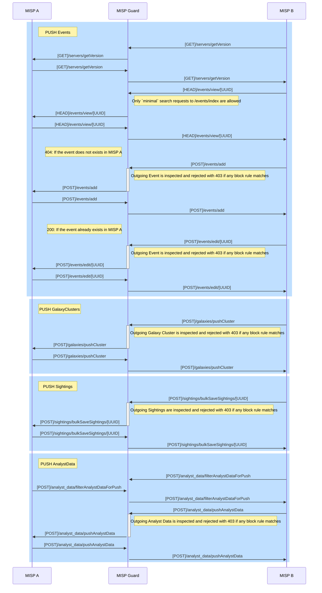
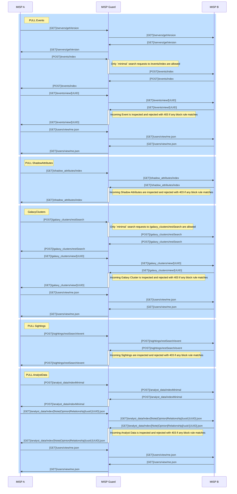

# misp-guard
`misp-guard` is a [mitmproxy](https://mitmproxy.org/) addon designed to apply configurable filters that prevent the unintentional leakage of sensitive threat intelligence data while facilitating controlled information sharing.

`misp-guard` functions as a proxy specifically designed to interact with and understand the MISP synchronization protocol. It monitors communications between MISP instances, allowing for real-time inspection and enforcement of security policies. MISP Guard effectively blocks incoming or outgoing data that matches configured filtering rules, ensuring sensitive or restricted information is not unintentionally shared.

> **NOTE: By default this addon will block all outgoing HTTP requests that are not required during a MISP server sync. However, individual URLs or domains can be allowed if necessary.**

## Objectives
To prevent data leakage in high-security environments such as military networks or critical infrastructure systems, `misp-guard` plays a crucial role by acting as a configurable enforcement layer during MISP instance synchronization. Its fine-grained filtering capabilities allow organizations to maintain strict control over what information is shared, ensuring compliance with compartmentalization policies and mitigating the risk of accidental data exposure.

Supported filters include:  
- **Compartment Rules**: Restrict data sharing based on predefined compartmentalization policies.  
- **Taxonomy Rules**: Control synchronization by enforcing taxonomy-specific filtering.  
- **Blocked Distribution Levels**: Prevent data with specific distribution levels from being shared.  
- **Blocked Sharing Groups**: Exclude data linked to restricted sharing groups.  
- **Blocked Attribute Types**: Filter specific attribute types from synchronization.  
- **Blocked Attribute Categories**: Restrict data belonging to selected attribute categories.  
- **Blocked Object Types**: Prohibit synchronization of specific object types.  
- **URL Allowlists**: Permit only explicitly approved URLs to pass through.  

## PUSH


## PULL



> **NOTE: The `MISP A` server needs to have the `misp-guard` hostname configured as the server hostname you are going to pull from, **not** the `MISP B` hostname.**

**Supported block rules:**
* `compartments_rules`: Compartments can be interpreted as a VLAN where one or more MISP are living, each compartment defines to which other compartments allows to sync.
* `taxonomies_rules`:
  * `required_taxonomies`: Taxonomies that have to be present in a event, otherwise it will be blocked.
  * `allowed_tags`: For each of the `required_taxonomies` a subset of allowed tags can be specified.
  * `blocked_tags`: Tags that cannot be present in any of the event entities.
* `blocked_distribution_levels`: Blocks if the event/objects/attributes matches one of the blocked distribution levels.
  * `"0"`: Organisation Only
  * `"1"`: Community Only
  * `"2"`: Connected Communities
  * `"3"`: All Communities
  * `"4"`: Sharing Group
  * `"5"`: Inherit Event
* `blocked_sharing_groups_uuids`: Blocks if the event/objects/attributes matches one of the blocked sharing groups uuids.
* `blocked_attribute_types`: Blocks if the event contains an attribute matching one of this types.
* `blocked_attribute_categories`: Blocks if the event contains an attribute matching one of this categories.
* `blocked_object_types`: Blocks if the event contains an object matching one of this types.

**Allowlist**

* To allow individual URLs or domains, simply add them as a JSON array under the `allowlist` element.
  * `urls` The entire URL is checked and only exact calls are allowed.
  * `domains` In contrast, only the domain is checked and any website behind the domain can be queried. Should only be used if adding exact URLs is not possible.

See sample config [here](src/test/test_config.json).

## Instructions

### Requirements
* Python 3.12 or newer.
* `venv` (recommended).

### Installation
```bash
$ git clone https://github.com/MISP/misp-guard.git
$ cd src/
$ apt install python3.12-venv
$ python3.12 -m venv .venv
$ source .venv/bin/activate
$ pip3 install -r requirements.txt
```

### Setup

1. Define your block rules in the `config.json` file.
2. Start mitmproxy with the `mispguard` addon:
    ```
    $ mitmdump -s mispguard.py -p 8888 --certs *=cert.pem --set config=config.json
    Loading script mispguard.py
    MispGuard initialized
    Proxy server listening at *:8888
    ``` 
    _Add `-k` to accept self-signed certificates._

3. Configure the proxy in your MISP instance, set the following MISP  `Proxy.host` and `Proxy.port` settings accordingly.

Done, outgoing MISP sync requests will be inspected and dropped according to the specified block rules.


> NOTE: add `-v` to `mitmdump` to increase verbosity and display debug logs.

### Testing
 ```
 $ pip install pytest pytest-asyncio
 $ src src/
 $ pytest
 ```
