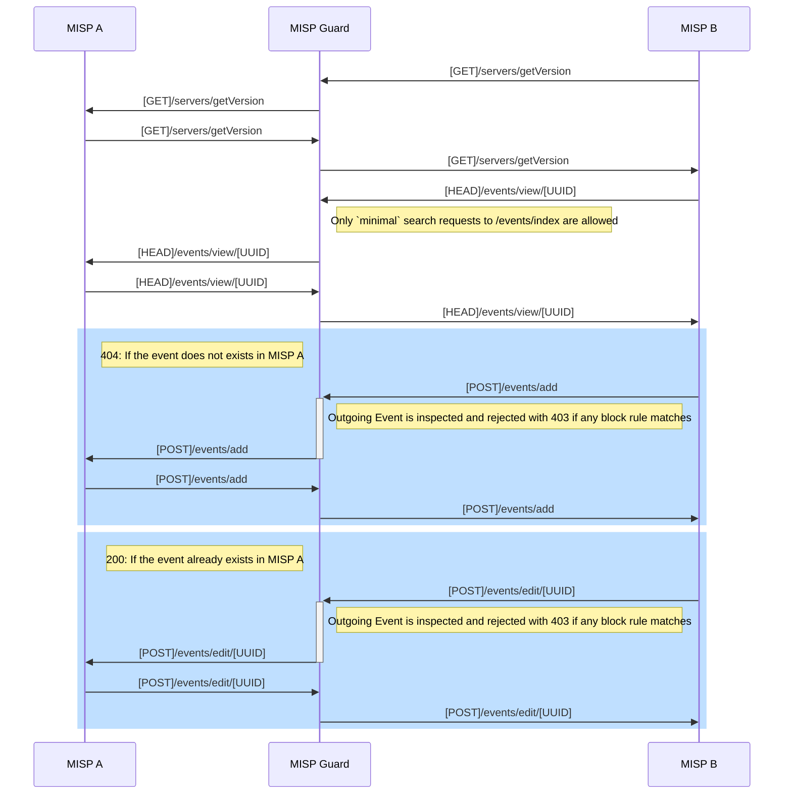
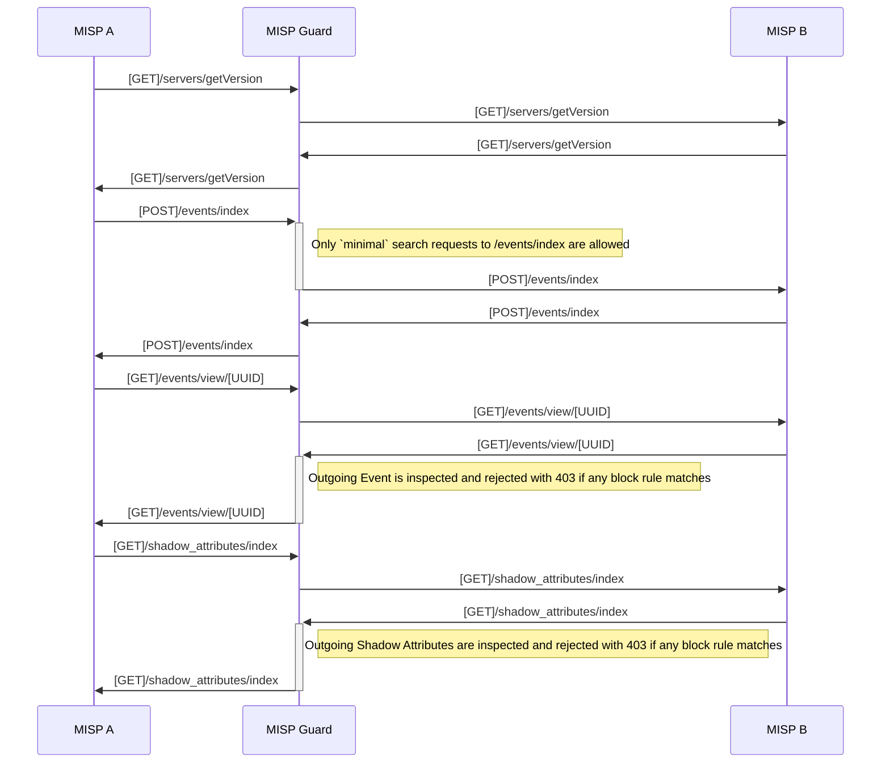

# misp-guard
`misp-guard` is a [mitmproxy](https://mitmproxy.org/) addon that inspects the synchronization traffic (via `PUSH` or `PULL`) between different MISP instances and applies a set of customizable rules defined in a JSON file.

> **NOTE: By default this addon will block all outgoing HTTP requests that are not required during a MISP server sync.**

## PUSH


## PULL



> **NOTE: The `MISP A` server needs to have the `misp-guard` hostname configured as the server hostname you are going to pull from, **not** the `MISP B` hostname.**

**Supported block rules:**
* `compartments_rules`: Compartments can be interpreted as a VLAN where one or more MISP are living, each compartment defines to which other compartments allows to sync.
* `taxonomies_rules`:
  * `required_taxonomies`: Taxonomies that have to be present in a event, otherwise it will be blocked.
  * `allowed_tags`: For each of the `required_taxonomies` a subset of allowed tags can be specified.
  * `blocked_tags`: Tags that cannot be present in any of the event entities.
* `blocked_distribution_levels`: Blocks if the event/objects/attributes matches one of the blocked distribution levels.
  * `"0"`: Organisation Only
  * `"1"`: Community Only
  * `"2"`: Connected Communities
  * `"3"`: All Communities
  * `"4"`: Sharing Group
  * `"5"`: Inherit Event
* `blocked_sharing_groups_uuids`: Blocks if the event/objects/attributes matches one of the blocked sharing groups uuids.
* `blocked_attribute_types`: Blocks if the event contains an attribute matching one of this types.
* `blocked_attribute_categories`: Blocks if the event contains an attribute matching one of this categories.
* `blocked_object_types`: Blocks if the event contains an object matching one of this types.

See sample config [here](src/test/test_config.json).

## Instructions

### Installation
```bash
$ git clone https://github.com/MISP/misp-guard.git
$ cd src/
$ pip install -r requirements.txt
```

### Setup

1. Define your block rules in the `config.json` file.
2. Start mitmproxy with the `mispguard` addon:
    ```
    $ mitmdump -s mispguard.py -p 8888 --certs *=cert.pem --set config=config.json 
    Loading script mispguard.py
    MispGuard initialized
    Proxy server listening at *:8888
    ``` 
    _Add `-k` to accept self-signed certificates._

3. Configure the proxy in your MISP instance, set the following MISP  `Proxy.host` and `Proxy.port` settings accordingly.

Done, outgoing MISP sync requests will be inspected and dropped according to the specified block rules.


> NOTE: add `-v` to `mitmdump` to increase verbosity and display debug logs.

### Testing
 ```
 src src/
 pytest
 ```