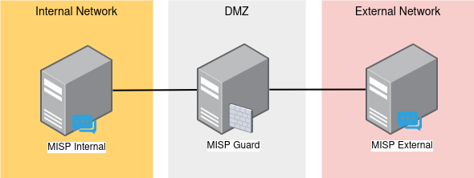
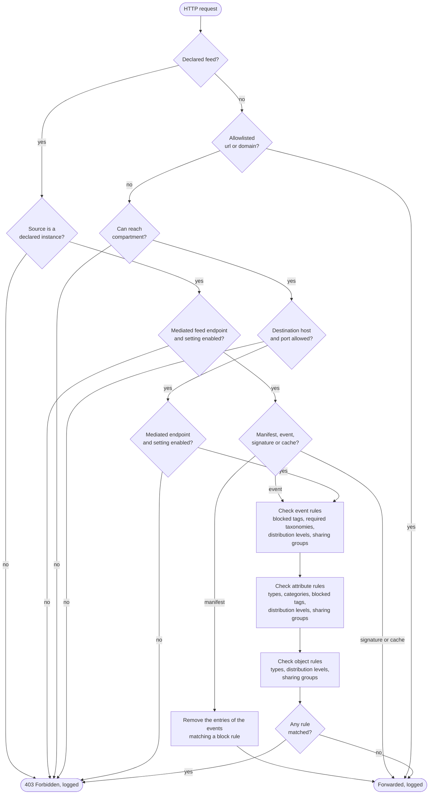
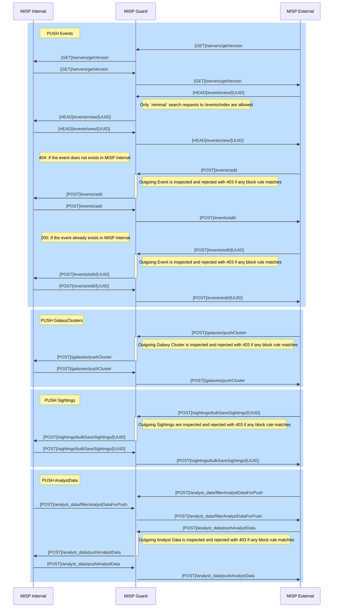
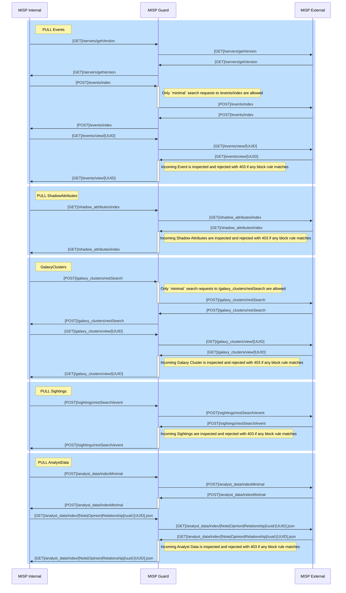
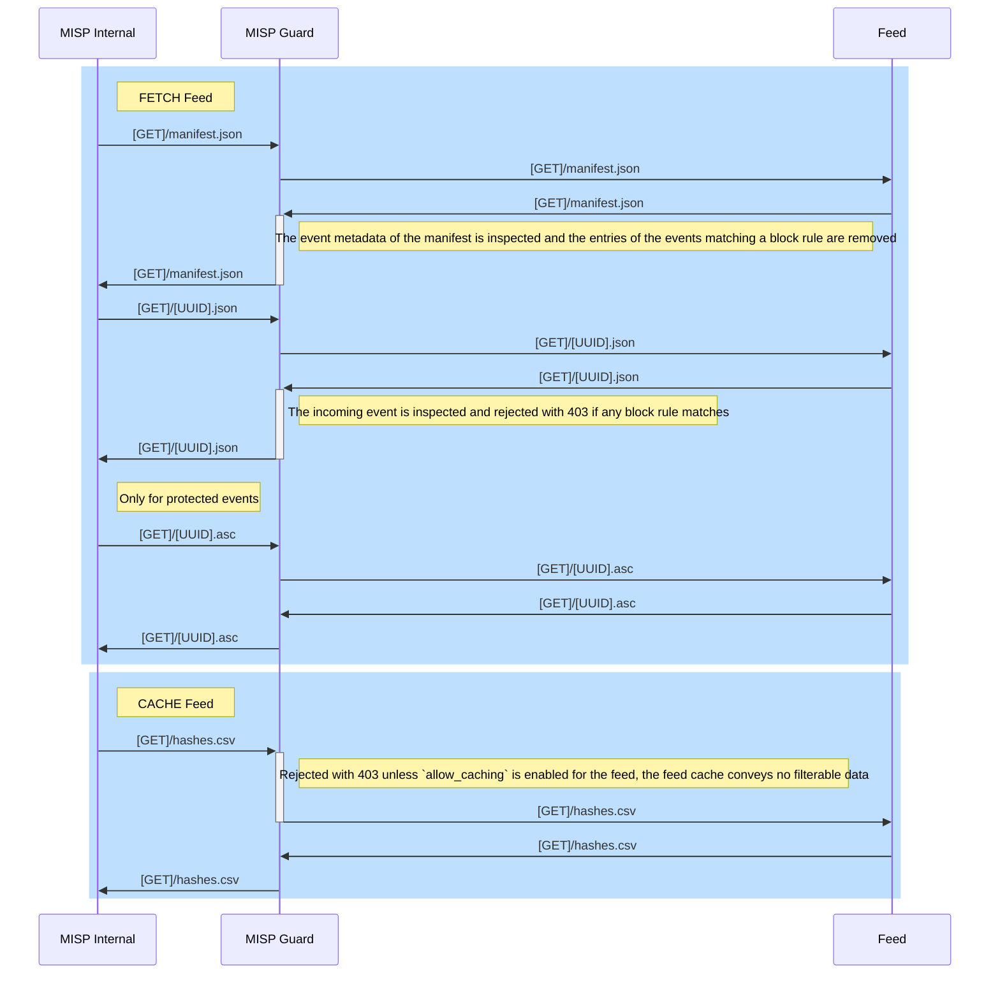
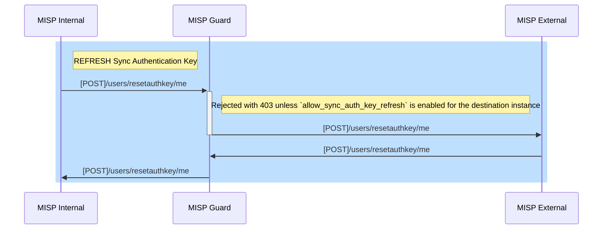

# MISP Guard -  Common Criteria EAL 2 Evaluation

| | |
|-|-|
| **Document version** | 1.3 (current revision) |
| **Date** | 2026-09-01 |
| **Target of Evaluation** | MISP Guard v1.3 |
| **Reviewer** | CIRCL - Computer Incident Response Center Luxembourg |

**Revision history**

| Version | Date | Reviewer | Changes |
|-|-|-|-|
| 1.3 | 2026-09-01 | CIRCL | Addition of the feed ingestion and of the synchronization user authentication key refreshal functions (Sections 5.3 and 5.4). Addition of the TLS interception considerations (Sections 2.1, 3.3 and 6.3) and of the glossary (Section 14.2). Regeneration of the test evidence (Section 14.3). |
| Earlier revisions | | | Not recorded in this document. |

## 1. Executive Summary
The evaluation of *MISP Guard* aims to ensure that it effectively fulfills its primary purpose of acting as a secure intermediary between *MISP (Threat Information Sharing Platform)* instances. As a *mitmproxy* [^1] addon [^2], *MISP Guard* is designed to apply configurable filters that prevent the unintentional leakage of sensitive threat intelligence data while facilitating controlled information sharing. The evaluation seeks to verify that the addon’s filtering mechanisms, configuration options, and logging capabilities align with its stated security objectives, ensuring compliance with industry best practices for information flow control and data protection. By conducting this evaluation at Evaluation Assurance Level 2 (EAL 2) under the Common Criteria framework, the assessment establishes a moderate level of confidence in the product’s design, implementation, and operational effectiveness.

*MISP Guard* functions as a proxy specifically designed to interact with and understand the MISP synchronization protocol. It monitors communications between MISP instances, allowing for real-time inspection and enforcement of security policies. *MISP Guard* effectively blocks incoming or outgoing data that matches configured filtering rules, ensuring sensitive or restricted information is not unintentionally shared.  

Supported filters include:  
- **Compartment Rules**: Restrict data sharing based on predefined compartmentalization policies.  
- **Taxonomy Rules**: Control synchronization by enforcing taxonomy-specific filtering.  
- **Blocked Distribution Levels**: Prevent data with specific distribution levels from being shared.  
- **Blocked Sharing Groups**: Exclude data linked to restricted sharing groups.  
- **Blocked Attribute Types**: Filter specific attribute types from synchronization.  
- **Blocked Attribute Categories**: Restrict data belonging to selected attribute categories.  
- **Blocked Object Types**: Prohibit synchronization of specific object types.  
- **URL Allowlists**: Permit only explicitly approved URLs to pass through.  

This granular filtering ensures fine-tuned control over data synchronization while protecting against the leakage of sensitive information. These mechanisms are detailed in Section 5.

Starting with version 1.3, the traffic mediated by *MISP Guard* is extended beyond instance to instance synchronization with two additional functions:
- **Feed Synchronization**: Remote MISP format feeds can be declared in the configuration, allowing a MISP instance to fetch them through *MISP Guard*. The feed manifest and every event fetched from the feed are inspected with the same set of filtering rules applied to instance synchronization.
- **Sync User Authentication Key Refreshal**: The renewal of the authentication key of the synchronization user can be permitted on a per instance basis, so the credential used for synchronization can be rotated without establishing a direct channel between the instances.

Both functions deny by default: no feed can be fetched unless it is declared in the configuration, and no authentication key can be refreshed unless the corresponding instance setting is enabled. These mechanisms are detailed in Sections 5.3 and 5.4.

The evaluation of MISP Guard was conducted against the criteria specified for Evaluation Assurance Level 2 (EAL 2) under the Common Criteria framework. EAL 2 provides a moderate level of assurance based on structural testing and analysis, suitable for commercial off-the-shelf products where trust is primarily established through a thorough evaluation of functional behavior and limited design inspection. 

The EAL 2 evaluation required MISP Guard to meet the following key assurance components:  
1. **Configuration Management (ACM):** Evidence that MISP Guard is maintained under configuration control, ensuring consistent deployment across environments.  
2. **Delivery and Operation (ADO):** Confirmation that the software can be securely delivered and installed, with proper operational guidance to maintain its security features.  
3. **Development (ADV):** Verification of the high-level design and functional specifications, demonstrating alignment with security objectives.  
4. **Guidance Documents (AGD):** Comprehensive documentation for secure installation, configuration, and usage.  
5. **Testing (ATE):** Demonstration of functional testing to validate security requirements and confirm no significant vulnerabilities exist under normal use.  

**Key Outcomes of the Evaluation**
1. MISP Guard successfully implements robust information flow controls to prevent the leakage of sensitive data between connected MISP instances, fulfilling its primary security objectives.
2. Configuration management and deployment procedures ensure that the software can be securely delivered, reducing the risk of integrity compromise during setup.
3. Functional testing validated the enforcement of filtering rules, confirming that the addon accurately blocks or allows data as specified in the configuration, with detailed logging capabilities supporting traceability.
4. Vulnerability assessments revealed no exploitable weaknesses in the filtering mechanism.
5. MISP Guard demonstrated conformity with EAL 2 requirements, making it suitable for environments where moderate assurance is sufficient to mitigate risks of information leakage.

The evaluation concludes that MISP Guard provides an effective and configurable solution for preventing unintentional data leaks within the MISP ecosystem, with assurance that its security controls function as designed under defined conditions.

[^1]: https://docs.mitmproxy.org/
[^2]: https://docs.mitmproxy.org/stable/addons-overview/

## 2. Introduction
Although MISP includes built-in security features and mechanisms to prevent information leakage and ensure data is shared only with authorized MISP instances, a user group raised concerns about mitigating the risk of a potential failure in these built-in security mechanisms. To address this concern, the idea emerged to create a separate, dedicated software solution. This solution would act as an intermediary, inspecting traffic between MISP instances and enforcing a configurable set of rules to block incoming or outgoing data that matches defined filters. This added layer of protection ensures robust control over data sharing and reduces the likelihood of unintentional information leakage. 

Given its widespread popularity, permissive licensing, and extensive documentation, mitmproxy was chosen as the core dependency for MISP Guard. As an open-source project, mitmproxy offers the advantages of transparency through code auditing, ensuring users can verify its security and reliability. Additionally, its flexibility in allowing the development of custom add-ons made it an ideal choice to serve as the foundation for MISP Guard's functionality.

MISP Guard seamlessly integrates into existing MISP deployments. Its deployment process is straightforward: configure the MISP instance to use a proxy and point it to MISP Guard. This simplicity makes it accessible for administrators, even in complex environments, while leveraging the robust capabilities of mitmproxy to inspect and filter traffic between MISP instances effectively.

Regarding the evaluation of MISP Guard, the objectives are aligned with its design requirements to ensure the system meets both functional and security expectations. 

### 2.1. Boundaries of the Evaluation

The evaluation is conducted within a set of predefined boundaries to ensure clarity regarding the scope and assumptions of the assessment. These boundaries include:  

- **Unmodified MISP Instances**: It is assumed that the codebase of the MISP instances interacting with MISP Guard has not been deliberately modified to bypass the filtering rules enforced by the guard.  
- **Correct Configuration**: MISP Guard is assumed to be correctly configured in accordance with its operational and security requirements, including the proper application of filtering rules and synchronization parameters.  
- **Environment Integrity**: The underlying environment hosting both MISP instances and MISP Guard (e.g., operating systems, networks, and infrastructure) is assumed to be secure and free from malicious tampering.  
- **Controlled Access**: Access to MISP Guard, including administrative interfaces and configuration files, is assumed to be restricted to authorized users only.  
- **Standard Networking Setup**: The network communication between MISP instances and MISP Guard operates under normal conditions without deliberate interference such as man-in-the-middle attacks or unauthorized packet injections beyond the context of the evaluation.  
- **Data Accuracy**: It is assumed that the data exchanged between MISP instances is accurate and correctly classified prior to being processed by MISP Guard.  
- **External Dependencies**: Dependencies such as mitmproxy, operating system components, and external libraries are assumed to function as intended and are not compromised.  
- **No Intentional Subversion**: It is assumed that no stakeholders (e.g., administrators or developers) intentionally configure or manipulate the system in ways that would undermine its security objectives.  
- **Trusted Interception Material**: The certificate and the private key used by MISP Guard to intercept the TLS connections between the MISP instances are assumed to be generated and protected by the administrator, to be trusted by the MISP instances for this purpose only, and not to be shared with any other system.  

These boundaries establish the evaluation’s context by clearly defining assumptions and expectations about the TOE and its operational environment. Any scenarios beyond these boundaries are considered out of scope for this evaluation.  


## 3. Target of Evaluation (TOE)
### 3.1. TOE Identification
The evaluation covers MISP Guard version 1 (v1) and its minor releases, focusing on its filtering capabilities, logging mechanisms, configuration options, and integration with MISP instances for secure data synchronization. Minor updates that maintain these core functions and objectives are included in the scope.  

Version 1.3 extends the TOE with the ingestion of remote MISP feeds and with the optional refreshal of the synchronization user authentication key. Both are additions that preserve the core functions and objectives of the TOE, they reuse the same filtering engine, configuration mechanism and audit logging, and are therefore included in the scope of this evaluation.  

The exact revision covered by this document is the `v1.3` release of the repository, tag `v1.3`, commit `TODO_V13_COMMIT`. The delivery and configuration management procedures applying to it are described in Sections 10.1 and 10.2.  

The evaluation excludes the **mitmproxy** dependency, which serves as a foundational component for traffic interception and inspection. It is assumed that mitmproxy functions correctly and as intended.  

External components or libraries used by MISP Guard, as well as infrastructure, operating system hardening, or deployment-specific security controls, are also outside the evaluation’s scope. The assessment is strictly focused on ensuring that MISP Guard fulfills its designed security and functional objectives.  

### 3.2. TOE Features

The primary features of MISP Guard include the following:  

- **Support for MISP Exchange**: The guard system must support seamless MISP data exchange between different compartments[^3], ensuring proper isolation and controlled sharing.  
- **Releasability Compliance**: The system should forward MISP events to the appropriate compartment based on the releasability settings specified for the data.  
- **Fault Recovery**: The guard system must include mechanisms to recover from synchronization failures effectively, minimizing data loss or duplication.  
- **Minimal Data Storage**: Except for sanitized MISP event metadata (e.g., UUID, creator user, creation date, creator organization, tags, distribution, publishing status, and date), no event content should be stored on the guard system's disk.  
- **In-Memory Processing**: All synchronization processes should occur in memory to enhance security and performance.  
- **Alerts**: The system should alert whenever events are blocked by the applied filtering rules.  
- **Long-Term Logging**: The guard system must maintain detailed logs of all transactions for a minimum of five years to support traceability and audits.  
- **Deployment as a Virtual Appliance**: The system should be packaged as a virtual appliance (e.g., a stripped-down Linux environment with the necessary libraries and services) for secure and easy deployment.  
- **Filters Management**: Administrators should be able to modify synchronization filters easily through straightforward configuration.  
- **Flexibility in Synchronization**: Adding or removing synchronization with new compartments should be simple and efficient.  
- **Attribute Enforcement**: The guard system must enforce authority, classification, and releasability attributes for every MISP event, whether existing or newly created.  
- **Feed Ingestion**: The guard system must allow the ingestion of the remote MISP feeds explicitly declared in its configuration, applying to the ingested data the same filtering rules used for instance synchronization.  
- **Synchronization Credential Renewal**: The guard system must allow, on a per instance basis, the renewal of the authentication key of the synchronization user, so that credential can be rotated without establishing a direct channel between the instances.  

These features collectively ensure that MISP Guard achieves its purpose as a robust, secure, and efficient intermediary for managing MISP data exchanges while preventing information leakage.  

   - Details of external interactions:
     - MISP input and output data streams processed by the proxy.
     - User interfaces or configuration files for filter management.
   - Core security functions:
     - Filtering rules enforcement.
     - Logging and monitoring filtered content.

[^3]: A compartment is a logical group of MISP instances that can comunicate with each other. By default any comunication between different compartments is blocked. To allow a MISP instance in compartment *A* to communicate to a MISP instance in compartment *B* an specific rule has to be introduced in the MISP Guard configuration.
     - Filters for preventing sensitive data leaks.
     - Policies or configuration options enabling customization.

### 3.3. TOE Environment
The evaluation environment represents the intended use case of MISP Guard as an intermediary proxy between MISP instances, with all communication routed through it for filtering and inspection. The MISP instances are assumed to be in isolated networks, communicating solely via MISP Guard to prevent direct data exchange between them.

The environment assumes secure communication protocols (e.g., HTTPS) and proper network configuration, ensuring the integrity and security of data exchanges. This setup reflects the realistic deployment scenario, focusing on MISP Guard’s role in preventing information leakage.

When the feed ingestion function is used, the hosts serving the declared remote feeds are an additional element of the environment. They are external, non MISP hosts, they are assumed to be reachable only through MISP Guard, and they are not assumed to be trusted: the data they serve is subject to the same filtering as the data received from another MISP instance.

For the evaluation the following instractructure will be used:



The communication between the MISP instances is protected with TLS. As the traffic has to be inspected in order to be filtered, MISP Guard terminates the TLS connection established by the source instance and opens a separate one towards the destination, therefore it presents a certificate of its own to the MISP instances and it holds the corresponding private key. The implications of this are described in Section 6.3.

For this purpose **mitmproxy** has to be executed with the following parameters:

* `-s mispguard.py` or `--script mispguard.py` so the MISP Guard addon is loaded.
* `--set config=config.json` pointing to a valid configuration file with a defined set of rules and filters.
* `--certs *=cert.pem` pointing to the certificate and private key presented to the MISP instances, which have to trust it in order for the interception to succeed.


## 4. Security Target (ST) Overview

The Common Criteria classes and families referenced throughout this section, as well as the MISP specific terms used in this document, are listed in Section 14.2.

### 4.1. FDP: User Data Protection
#### 4.1.1. FDP_ACC: Access Control Policy

##### Subjects
The entities (users, processes, or roles) within the system that request access to information objects.
- Users accessing the configuration or logs of the guard system.  
- MISP instances attempting to transfer or modify data.  
- MISP instances attempting to fetch data from a remote feed.  

##### Information Objects
The resources or data subject to access control, such as:  
- MISP event content and metadata.  
    - Objects
    - Attributes
    - Galaxy Clusters
    - Sightings
    - Analyst Data
- Remote MISP feed content and metadata.  
    - Feed manifest
    - Feed events
    - Feed cache
- Authentication keys of the synchronization users.  
- Configuration files containing synchronization parameters or filters.  
- Logs of system transactions or activities.  

##### Operations
The specific actions performed on the information objects, such as:  
- **Read**: Viewing system logs.  
- **Write**: Updating configurations or modifying filtering rules.  
- **Transfer**: Allowing the flow of MISP data between MISP instances, or from a remote feed to a MISP instance.
- **Refresh**: Renewing the authentication key of the synchronization user on a destination MISP instance.

##### Security Attributes
The attributes used to make access decisions:
- Object sensitivity levels (e.g., public, restricted, confidential).  
- System-defined rules, such as compartments, taxonomies, or releasability attributes.  

##### Access Control Rules
The rules that define whether an operation is permitted or denied based on the subject, the information object, and their associated security attributes. Examples include:  
- Only authorized administrators can modify configuration parameters.  
- Certain MISP events may only be transfered between MISP instances in specific compartments.  
- Certain MISP events will be blocked from being trasfered if not matching certain rules such as releasilibity criteria.
- Only the remote feeds declared in the configuration may be fetched, and only by the MISP instances declared in the configuration.
- The authentication key of the synchronization user may only be refreshed on the destination MISP instances where this operation has been explicitly enabled.
- Logs may be accessed only by specific roles with sufficient permissions.  

##### Conditions
Contextual or environmental factors influencing access control, such as:  
- Time-based restrictions (e.g., maintenance windows).  
- Network location and permissions of the requestor.  


##### Example: Access Control Policy for MISP Guard

MISP Guard enforces an access control policy where:  
1. Only MISP Guard administrators can access or modify system configuration files.  
2. Filtering rules are enforced to prevent unauthorized subjects or processes from accessing restricted MISP event data.  
3. Access to logs is restricted to only the adminsitrators of MISP Guard.  
4. Only trusted MISP instances that satisfy predefined network and security conditions can interact with the system.  
5. Only explicitly declared remote feeds can be fetched, and only the endpoints of those feeds that convey filterable data, or whose fetching has been explicitly permitted, are mediated.  
6. Operations that are not part of the synchronization itself, such as the refreshal of the synchronization user authentication key, are only permitted where the corresponding setting has been explicitly enabled.  

By defining and enforcing these rules, the **FDP_ACC** requirement ensures secure and controlled access to the TOE’s information objects, aligned with its operational and security objectives.

#### 4.1.2. FDP_IFC: Information Flow Control Policy

The information flow control policy for MISP Guard governs the synchronization of data between source and destination MISP instances, ensuring that only permissible data flows occur. The policy defines constraints based on metadata attributes, event content, and the relationships between MISP instances in different compartments or networks.  

The core objective of this policy is to prevent unauthorized or unintentional sharing of sensitive information while maintaining the functional requirements of MISP synchronization.


##### Scope
- The policy applies to all data flows between MISP instances mediated by MISP Guard.  
- The policy applies to the data flows from the remote feeds declared in the configuration towards the MISP instances fetching them.  
- It controls outgoing and incoming data at both the metadata and content levels.  
- The policy does not apply to data internal to the source or destination MISP instances.

##### Policy Rules

1. **Allowed and Restricted Data**:  
   - Only data satisfying predefined filters (e.g., compartments, taxonomies, or sharing groups) is allowed to flow between MISP instances.  
   - Data with restricted attributes (e.g., blocked object types or attribute types) is denied.  
   - Only the data flows utilized by the MISP synchronization, by the fetching of the declared remote feeds and, where explicitly enabled, by the refreshal of the synchronization user authentication key are allowed to transit via MISP Guard, everything else is blocked.

2. **Compartmentalization**:  
   - Events are only synchronized to MISP instances within the permitted compartments.  

3. **Taxonomy Constraints**:  
   - Events containing tags from blocked taxonomies are excluded from synchronization.  
   - Events missing required taxonomies are excluded from synchronization.

4. **Distribution Control**:  
   - Events or event data with specific distribution level (e.g., "This community only") are excluded from synchronization.  
   - Events or event data with specific sharing groups are excluded from synchronization.  

5. **Event Data Constraints**:  
   - Events containing attributes with specific attribute types (e.g., "passport-number") are excluded from synchronization.  
   - Events containing attributes with specific attribute categories (e.g., "Person") are excluded from synchronization.  
   - Events containing objects with specific object templates (e.g., "person") are excluded from synchronization.  

6. **Feed Constraints**:  
   - Only the feeds declared in the configuration can be fetched, and only by the MISP instances declared in the configuration.  
   - The events advertised in a feed manifest that match a block rule are removed from the manifest, so they are never requested by the fetching MISP instance.  
   - Feed events matching a block rule are excluded from the ingestion.  
   - The feed cache, which conveys no filterable data, is only allowed for the feeds where it has been explicitly enabled.  

7. **Synchronization Credential Constraints**:  
   - The refreshal of the synchronization user authentication key is only allowed towards the destination instances where it has been explicitly enabled, and only for the key of the authenticated user itself.  


##### Information Flow Attributes
The policy evaluates the following attributes when determining whether a flow is allowed or blocked:  
- **Compartments**: Logical zones or environments defined for data segregation.  
- **Taxonomies**: Blocked or required tags indicating the type of data, releasability, confidentiality or other metadata.  
- **Distribution Levels**: Predefined levels of data accessibility.  
- **Sharing Groups**: Specific MISP sharing groups blocked from being in transit.  
- **Attribute Types and Categories**: Restrictions on specific types of attributes (e.g., IP addresses or email content).  
- **Object templates**: Restrictions on specific object templates (e.g., Person).  
- **Feeds**: The remote feeds declared in the configuration, identified by their url, together with the set of filtering rules associated to each of them.  


##### Flow Control Decision Points
The decision to allow or block information flow is based on:  
1. **Source-Destination Relationships**: Whether the source instance has permission to share with the destination instance.  
2. **Event Data**: Whether event metadata or content matches restricted filters.  
3. **Feed Declaration**: Whether the requested resource belongs to a feed declared in the configuration and whether the requesting instance is a declared one.  
4. **Endpoint Authorization**: Whether the requested endpoint belongs to the mediated protocol and, for the endpoints subject to a configuration setting, whether that setting is enabled.  

##### Policy Objectives

1. **Prevent Information Leakage**:  
   Ensure that sensitive data cannot flow to unauthorized MISP instances or restricted compartments.  

2. **Support Configurability**:  
   Allow administrators to define and update filtering rules based on operational needs and security policies.  

3. **Ensure Transparency**:  
   Provide detailed logs of all allowed and blocked flows for traceability and auditing.  

##### Justification of Policy Compliance
The FDP_IFC policy aligns with the operational and security objectives of MISP Guard, ensuring that data flows are strictly controlled and monitored. By leveraging well-defined rules and filters, the policy effectively minimizes the risk of unauthorized synchronization while supporting secure and flexible threat intelligence sharing.

#### 4.1.3. FDP_IFF: Information Flow Control Functions

##### Subjects
Entities initiating or participating in the information flow, such as:  
- **Source MISP Instances**: The systems providing data for synchronization.  
- **Destination MISP Instances**: The systems receiving data from the source via MISP Guard.
- **Remote MISP Feeds**: The external sources providing data to be ingested by a MISP instance via MISP Guard.

##### Information Objects
The data being inspected, processed, and controlled, which include:  
- **MISP Event Metadata**: Tags, sharing group identifiers, distribution levels, etc.  
- **MISP Event Content**: Attributes (e.g., IPs, domains, hashes) and object structures.
- **MISP Feed Metadata and Content**: The entries of a feed manifest, the events of a feed and the feed cache.

##### Security Attributes
Attributes used to evaluate and enforce flow control rules:  
- **Compartments**: Logical partitions or groups defining where data can flow.  
- **Taxonomies**: Categorization or tagging attributes used for filtering.  
- **Sharing Groups**: Restrictive groupings that control distribution.  
- **Distribution Levels**: Permissions controlling data availability (e.g., "This community only").  
- **Object and Attribute Types**: Data classifications that determine flow constraints.  
- **Feed Rules**: The set of filtering rules associated to each declared remote feed.  

##### Rules for Information Flow Control
The system enforces filtering rules to manage information flows. These rules include:  
1. **Blocking Rules**:  
   - Prevent synchronization of events that contain attributes or objects flagged as restricted based on sharing groups, taxonomies, or distribution levels.  
   - Restrict synchronization of specific object types or attribute types to destination MISP instances.  
2. **Forwarding Rules**:  
   - Forward events to only to allowed compartments if they meet the defined security and policy criteria.  
3. **Sanitization Rules**:  
   - Remove from a feed manifest the entries of the events matching a block rule, so those events are never requested by the fetching MISP instance. This is the only case in which MISP Guard alters the content of a mediated message. The events themselves are never modified, they are either forwarded unaltered or rejected as a whole.  

##### Conditions
Contextual parameters influencing the rules applied, such as:  
- Source-destination pairings (e.g., flow allowed between compartments A and B only).  
- Filters active at the time of synchronization.  
- Explicit tagging of data for specific handling.  

##### Functional Mechanisms
Mechanisms used to enforce flow control functions:  
- **Filter Matching Engine**: Compares metadata and content against predefined rules to block or allow flows.  
- **Memory-Based Processing**: Handles synchronization in memory, preventing sensitive information from being stored.  
- **Alerts**: Notifies data publishers when events are blocked due to rule violations.  
- **Logging**: Captures detailed logs of blocked and allowed flows for auditing and traceability.  

##### Examples of Information Flow Control Functions in MISP Guard

1. **Blocking Taxonomies**:  
   A rule prevents data tagged with certain taxonomies (e.g., "TLP:RED") from being forwarded to external MISP instances.  

2. **Compartment Enforced Flow**:  
   MISP instances in different compartments will only be able to communicate if this is explicitly allowed by a compartment rule.  

3. **Restricted Data Flows**:  
   When forwarding MISP events, sensitive details (e.g., attribute of type passport-number) are blocked, preventing leakage of such information.  

4. **Filtered Feed Ingestion**:  
   An event advertised in a feed manifest with a blocked tag (e.g., "TLP:RED") has its entry removed from the manifest, and is rejected if requested directly, preventing its ingestion by the fetching MISP instance.  

##### Justification of Compliance with Security Objectives

These information flow control functions ensure compliance with the overarching policy (FDP_IFC), mitigating risks of information leakage, enforcing security constraints, and maintaining data flow integrity. They serve the core purpose of MISP Guard: enabling secure and compliant communication between MISP instances.

### 4.2. FAU: Security Audit Data
#### 4.2.1. FAU_GEN: Security Audit Data Generation
MISP Guard generates audit logs for all security-relevant events occurring during its operation. The logs provide a detailed account of system activities, including:  
1. **Data Flow Actions**:  
   - Allowed synchronizations between MISP instances.  
   - Blocked events based on filter policies.  
   - Feed fetches, including the entries removed from a feed manifest and the feed events blocked by filter policies.  
   - Requests rejected because the endpoint is not mediated or because the configuration setting enabling it is not enabled.  
2. **Configuration Changes**:  
   - Modifications to filtering rules or synchronization parameters.  
   - Addition, deletion, or modification of compartments or associated MISP instances.  
3. **System Activity**:  
   - Startup and shutdown events.   
4. **Debug**: 
    - Provides additional insights on the addon operation and operations performed.

##### Contents of Audit Records
Each audit record generated includes the following details:  
1. **Date and Time**: Accurate timestamp for when the event occurred.  
2. **Event Type**: Type of security-relevant activity (e.g., synchronization blocked, configuration modified).  
3. **Event Details**: Additional information relevant to the event:  
   - Filters applied and their outcomes.  
   - Attributes or objects affected.  
   - Action results (e.g., success, failure, or partial completion).  

##### Logging Mechanisms
1. **Secure Storage**:  
   - Audit logs are stored securely and protected from unauthorized modification or deletion.  
2. **Retention Period**:  
   - Logs are retained for at least 1 year by default. Log retention period can be configured modifying the `handlers.file.backupCount` parameter in the `logging.yaml` configuration file to meet the 5 years requirement.
   - The default value does not satisfy the five year retention requirement stated in Section 3.2. Adjusting it is a mandatory deployment step for the deployments subject to that requirement.
3. **Rotation**: 
   - By default logs are rotated daily. Log rotation frequency can be configured modifying the `handlers.file.when` parameter in the `logging.yaml` configuration file.
4. **Access Control**:  
   - Logs are accessible only to authorized administrators, ensuring privacy and integrity.  


##### Real-Time Alerts
MISP Guard does not support real-time notifications. Other log monitoring tools can be deployed for setting alerts on specific log entries to achive such goal, this functionality is out of the scope of MISP Guard.

##### Objectives of Audit Logging
1. **Accountability**: Track all significant actions and changes within the system to ensure traceability.  
2. **Potential Leak Detection**: Identify potential leaks or anomalies in the MISP synchronization.  
3. **Forensic Analysis**: Provide detailed records for investigating security incidents.  
4. **Compliance**: Demonstrate adherence to regulatory and organizational security requirements.  

##### Justification of Compliance
By implementing FAU_GEN, MISP Guard ensures robust auditing and logging capabilities, enabling administrators to monitor system activities, investigate security issues, and enforce accountability. This mechanism is crucial for maintaining the integrity and security of MISP operations.

#### 4.2.2. FAU_SAR: Security Audit Review
MISP Guard ensures that security audit records are accessible to authorized administrators responsible for monitoring and maintaining the system.

##### Audit Log Review Capabilities
1. **Review Interfaces**:  
   - **CLI (Command-Line Interface)**: Administrators can use prebuilt commands or scripts to query audit logs.  


##### Administrative Responsibilities
Authorized users must regularly review security audit records for:  
- **Identifying Irregularities**: Investigating anomalous or unexpected behavior.  
- **Ensuring Compliance**: Verifying that audit logging meets organizational and regulatory standards.  
- **Operational Insights**: Monitoring data flows and understanding the reasons behind blocked or allowed actions.  

##### Alerts and Notifications
If applicable, automatic alerts can be set up if external log parsers are configured for certain critical events (e.g., unauthorized access attempts, blocked synchronization requests).

##### Logging and Storage Controls
1. **Data Integrity**: Only administrators can access log files, the user running the MISP Guard process must be the only user with permissions to write log files.
2. **Retention Policy**: Records are stored securely and can be reviewed throughout the five-year retention period or longer as per configuration.  

##### Review Requirements* 
- Administrators are required to perform periodic reviews of audit records based on the organization's operational needs and policies.  
- Anomalies, policy violations, or security incidents identified during review must be escalated to appropriate stakeholders for resolution.  

##### **Justification of Compliance**
The FAU_SAR implementation in MISP Guard ensures that audit records are securely stored, easily accessible to authorized users, and comprehensively documented to support security monitoring, accountability, and compliance. These capabilities align with the operational and security objectives of the TOE.

### 4.3. FMT: Security management
#### 4.3.1. FMT_MSA: Management of Security Attributes

MISP Guard relies on configurable security attributes to control the synchronization of events between MISP instances. The attributes are integral to enforcing the information flow control policy (FDP_IFC) and defining which events or attributes can flow between compartments. This section details the mechanisms for managing these attributes securely and effectively.

##### Security Attributes Managed
1. **Compartments**: Logical groupings or domains that define the boundaries for synchronization.  
2. **Taxonomies**: Tag-based attributes used to classify data for filtering purposes.  
3. **Sharing Groups**: Specific groups allowed or disallowed access to shared events.  
4. **Distribution Levels**: Levels controlling how broadly an event can be shared (e.g., "this community only").  
5. **Blocked Categories and Types**: Attribute and object types excluded from synchronization (e.g., IP addresses, malware samples, personal information such as passport numbers).  
6. **Feeds**: The declaration of the remote feeds that can be fetched, identified by their format and url, together with the set of filtering rules and the cache permission associated to each of them.  
7. **Endpoint Permissions**: Per instance and per feed settings enabling the endpoints that are not part of the minimal set required for synchronization, such as the refreshal of the synchronization user authentication key or the fetching of a feed cache.  


##### Attribute Management Operations
1. **Definition of Attributes**:  
   - Administrators define the initial security attributes based on organizational requirements and policies.  
2. **Modification of Attributes**:  
   - Authorized administrators update or modify security attributes (e.g., changing blocked taxonomies or adjusting compartment mappings).  
3. **Removal of Attributes**:  
   - Deprecated or irrelevant attributes can be removed to streamline operations and maintain policy relevance.  

##### Management Interfaces
MISP Guard supports configurable rules via a JSON configuration file to define or adjust security attributes.

##### Access Control for Attribute Management
- Only authorized administrators are allowed to access and modify security attributes.  
- Modifications to attributes are logged as part of the audit functionality, ensuring accountability.  

##### Default Values and Initialization
1. **Default Attribute Values**:  
   MISP Guard provides a sample configuration file with pre-configured empty structure.  
   - In order to make MISP Guard operation this configuration has to be completed.

2. **System Initialization**:  
   - During deployment, administrators must configure mandatory attributes (e.g., compartment mappings and instances hostnames and IP addresses) before synchronization is allowed.  
   - The validity of the configuration file is verified with a JSON schema to ensure its correctness.

3. **Deny by Default**:  
   - The attributes governing the optional functions default to the most restrictive value. A feed that is not declared cannot be fetched, and an endpoint whose enabling setting is absent or disabled is rejected. Enabling any of them is always an explicit administrative action.


##### Security Attribute Constraints
The following constraints ensure the effective use and control of attributes:  
- Attributes must be defined with precision to avoid ambiguity in flow control decisions.  
- Attributes must be compatible with MISP Guard’s filtering mechanisms and runtime performance requirements.  

##### Justification of Compliance
MISP Guard’s implementation of FMT_MSA ensures that all security attributes are defined, managed, and controlled in a secure manner. By enabling authorized users to manage these attributes while enforcing access control and auditing, the TOE maintains its integrity and aligns with the requirements for robust security enforcement.

## 5. Functional Specification

### 5.1. Supported Filtering Functions

#### 5.1.1. Compartment Rules
- **Description**: Compartmentalization allows the segmentation of MISP instances into virtual environments. Each compartment defines its synchronization permissions with other compartments.  
- **Functionality**: MISP Guard enforces rules determining which compartments can exchange data, preventing unauthorized or unintended cross-compartment information flow.


#### 5.1.2. Taxonomies Rules
- **Required Taxonomies**:  
  - Events must contain certain mandatory taxonomies to qualify for synchronization. Missing required taxonomies results in blocking.  
- **Allowed Tags**:  
  - For each required taxonomy, a subset of acceptable tags can be specified. Events containing non-allowed tags under a required taxonomy are blocked.  
- **Blocked Tags**:  
  - Any event containing tags explicitly listed in the blocked tags set is rejected, ensuring sensitive or restricted classifications are not shared.


#### 5.1.3. Distribution Level Filters
- **Blocked Distribution Levels**:  
  - Prevents events, objects, or attributes from being synchronized if they match any of the specified distribution levels. The supported levels include:  
    - `0`: Organisation Only  
    - `1`: Community Only  
    - `2`: Connected Communities  
    - `3`: All Communities  
    - `4`: Sharing Group  
    - `5`: Inherit Event  

#### 5.1.4. Sharing Group Restrictions
- **Blocked Sharing Group UUIDs**:  
  - Events, objects, or attributes assigned to a blocked sharing group (by UUID) are rejected. This ensures data meant for restricted groups is not inadvertently synchronized with unauthorized MISP instances.

#### 5.1.5. Attribute-Type Filters
- **Blocked Attribute Types**:  
  - Filters events that contain attributes matching specific types (e.g., "ip-src" or "email-src"), blocking information deemed too sensitive or restricted for synchronization.

#### 5.1.6. Attribute-Category Filters
- **Blocked Attribute Categories**:  
  - Prevents events containing attributes from specific categories (e.g., "Network activity," "Financial fraud") from being shared with unauthorized MISP instances.

#### 5.1.7. Object-Type Filters
- **Blocked Object Types**:  
  - Blocks synchronization of events containing objects matching specific types (e.g., "file," "domain-ip"). This ensures only approved object types are shared between MISP instances.

### 5.2. Allowlist Functions

#### 5.2.1. URL Allowlist
- **URLs**:  
  - Allows synchronization of exact URLs specified in the allowlist JSON array. If a URL matches an entry, it is exempted from filtering and allowed for synchronization.  
- **Domains**:  
  - Allows synchronization based on domain matching. Any request for a domain listed in the allowlist is permitted, including any paths within the domain. This function should only be used when adding exact URLs is impractical.


### 5.3. Feed Filtering Functions

Remote feeds are declared under the `feeds` element of the configuration file. Each feed declares its format, its url and its own set of filtering rules, using the same rules described in Section 5.1. Only the feeds declared in the configuration can be fetched, and only by the MISP instances declared in the configuration.

#### 5.3.1. Supported Feed Formats
- Only the `misp` feed format is supported. A `misp` format feed is a directory exposing a manifest of the events available in the feed and one document per event.

#### 5.3.2. Mediated Feed Endpoints
The following endpoints of a declared feed are mediated, every other request towards the host of a feed is blocked as any other non mediated request:

| Endpoint | Description | Condition |
|-|-|-|
| `[GET]<FEED_URL>/manifest.json` | The metadata of the events available in the feed. | Always mediated. |
| `[GET]<FEED_URL>/[UUID].json` | An individual event of the feed. | Always mediated. |
| `[GET]<FEED_URL>/[UUID].asc` | The detached signature of a protected event of the feed. | Always mediated. |
| `[GET]<FEED_URL>/hashes.csv` | The feed cache used by the fetching instance for the feed correlation lookups. | Only if the `allow_caching` setting of the feed is enabled. |

#### 5.3.3. Two Stage Filtering
1. **Manifest Filtering**: The manifest conveys the metadata of every event available in the feed. Each entry is evaluated against the rules of the feed and the entries of the events matching a block rule are removed from the manifest before it reaches the fetching MISP instance, so those events are never requested. As the manifest metadata only conveys the event tags, the taxonomies rules described in Section 5.1.2 are the ones effectively applied at this stage.
2. **Event Filtering**: Every event document fetched from the feed is evaluated against the complete set of rules of the feed, in the same way as an event pulled from another MISP instance, and is rejected if any rule matches.

#### 5.3.4. Constraints and Residual Risks
- The events published in a MISP format feed do not convey a distribution level nor a sharing group. The rules described in Sections 5.1.3 and 5.1.4 are therefore evaluated on the entities of the ingested data that do define them, and are not enforceable at the level of the event itself.
- The feed cache conveys the hashes of the attribute values and the uuid of the event they belong to. It conveys no tags, types, categories or distribution levels, therefore its content cannot be evaluated against the filtering rules and is forwarded unaltered. An event that the filtering rules would reject can still contribute the hashes of its attribute values to the cache of the fetching instance. For this reason the fetching of the feed cache is disabled by default and has to be enabled per feed, as stated in Section 5.3.2.
- The detached signature of a protected event conveys no event data and is forwarded unaltered. As the events themselves are never modified by MISP Guard, the signature verification performed by the fetching MISP instance is not affected.
- Feeds are not part of a compartment. The flow from a feed towards a MISP instance is authorized by the declaration of the feed and by the requesting instance being a declared one, the compartment rules described in Section 5.1.1 do not apply to it.

### 5.4. Endpoint Authorization Functions

MISP Guard only mediates the endpoints required by the functions it supports, every other request is rejected. A subset of those endpoints is subject to an explicit permission in the configuration and is rejected unless the corresponding setting is enabled. The rejection is logged identifying the endpoint, the instance or feed concerned and the setting that would allow it.

#### 5.4.1. Sync User Authentication Key Refreshal
- **Description**: The authentication key of the synchronization user is the credential a MISP instance uses to authenticate against another one. Rotating it periodically limits the exposure of a compromised credential.
- **Functionality**: When the `allow_sync_auth_key_refresh` setting of an instance is enabled, `[POST]/users/resetauthkey/me` requests towards that instance are mediated, allowing the synchronization user to renew its own authentication key through MISP Guard.
- **Scope**: The setting is evaluated on the destination instance, the one holding the authentication key being renewed. Only the key of the authenticated user itself can be renewed, requests targeting the key of any other user are rejected.
- **Default**: Disabled. When the setting is absent or disabled the request is rejected as any other non mediated request.

#### 5.4.2. Feed Cache
- The fetching of the feed cache is subject to the `allow_caching` setting of the feed, as described in Sections 5.3.2 and 5.3.4.

### 5.5. Operational Workflow of Filtering

1. **Inbound and Outbound Inspection**:  
   - All communication between MISP instances is routed through MISP Guard, where events, attributes, and objects are subjected to filtering rules.  

2. **Rule Matching and Blocking**:  
   - If an event, attribute, or object matches any of the configured block rules, synchronization is stopped. MISP Guard generates an audit log of the blocked action.  

3. **Allowlist Verification**:  
   - If an event matches an allowlist rule, it bypasses the filters and proceeds to synchronization. This exception is logged for audit purposes.

4. **Feed Ingestion Inspection**:  
   - The manifest and the events of a declared feed are inspected as described in Section 5.3.3 before reaching the MISP instance that fetches them. Both the entries removed from a manifest and the rejected events are logged for audit purposes.

### 5.6. Design Objectives for Filtering Rules
The filtering functions provided by MISP Guard ensure:  
- Secure synchronization between authorized MISP instances and compartments.  
- Controlled ingestion of the data published by the declared remote feeds.  
- Prevention of unauthorized sharing of sensitive information.  
- Configurability to meet diverse operational and security requirements.  
- Comprehensive audit logging of allowed and blocked synchronization actions for accountability and forensic purposes.  


By implementing these functional specifications, MISP Guard enforces a robust set of security and filtering mechanisms, aligning with organizational needs to minimize information leakage and support secure threat intelligence sharing.

## 6. High-Level Design

### 6.1. Architecture Overview
MISP Guard functions as an intermediary proxy between MISP instances. HTTP traffic (requests and responses) is routed through MISP Guard, where it is inspected, evaluated against configured filtering rules, and either forwarded or blocked based on the outcome.

#### 6.1.1. **Core Components:**
- **Traffic Interceptor (Powered by mitmproxy)**
   - Intercepts HTTP(S) communication between MISP instances.
   - Provides hooks to analyze request headers, URLs, payloads, and responses.
   - Allows modification of traffic as needed, such as blocking requests.

- **Filtering Engine**
   - Applies configured rules to intercepted traffic, such as:
     - Compartment rules.
     - Taxonomy and tag rules.
     - Distribution level, sharing group, attribute, and object-type restrictions.
     - Feed rules, applied to the manifest and to the events of the declared remote feeds.
   - Determines whether traffic should be forwarded, sanitized or blocked.

- **Audit and Logging System**
   - Logs all filtering decisions, including reasons for blocked traffic.
   - Maintains detailed records for accountability and compliance.
   - Supports log formatting, filtering, and storage, aligning with organizational policies.

- **Configuration Manager**
   - Reads and applies filtering rules from configuration files.
   - Supports dynamic updates to rules without interrupting operations.

### 6.2. Mitmproxy Dependency

Mitmproxy serves as the backbone of MISP Guard's traffic interception and inspection. It is a robust and flexible Python-based tool tailored for handling HTTP and HTTPS traffic.

#### 6.2.1. Key Features Utilized in MISP Guard
- **Traffic Interception:**  
  Acts as a transparent proxy to capture all communication between MISP instances.

- **Extensibility:**  
  Supports custom Python scripts, enabling seamless integration of MISP Guard’s filtering logic.

- **Request and Response Analysis:**  
  Provides APIs to inspect HTTP request headers, bodies, and response content. These APIs allow MISP Guard to:
  - Match traffic against predefined filtering rules.
  - Block, modify, or forward requests and responses based on policy evaluations.

- **Scalability:**  
  Handles multiple simultaneous connections, making it suitable for environments with high data exchange requirements between MISP instances.

#### 6.2.2. Mitmproxy's Limitations
- MISP Guard relies on mitmproxy for basic traffic handling. However, the security, reliability, and correctness of mitmproxy itself are not within the scope of the TOE evaluation.


### 6.3. TLS Interception and Certificate Handling

The MISP synchronization protocol and the fetching of a remote feed are carried over HTTPS. In order to evaluate the filtering rules against the content of the exchanges, MISP Guard cannot forward the TLS connection untouched, it terminates the connection established by the requesting MISP instance and opens a separate connection towards the destination instance or towards the feed host.

This has the following consequences, which are properties of the deployment rather than of the addon itself:

- **Key material held by the TOE**: MISP Guard presents to the MISP instances a certificate provided by the administrator through the `--certs` parameter, and holds the corresponding private key. That key material must be readable only by the user running the MISP Guard process, in the same way as the log files described in Section 4.2.2. Its compromise would allow an attacker to impersonate the destination instance towards the MISP instances that trust it.
- **Trust established by configuration**: The MISP instances must be configured to trust the certificate presented by MISP Guard. This trust must be limited to the synchronization performed through MISP Guard, adding the certificate to a system wide trust store extends it well beyond the intended purpose.
- **Plaintext in memory**: The content of every mediated exchange exists in clear text inside the TOE for the duration of the evaluation of the rules. This is inherent to the filtering function and is consistent with the in memory processing feature stated in Section 3.2, no event content is written to disk.
- **Authentication of the destination**: mitmproxy verifies the certificate presented by the destination by default. This verification is disabled when it is executed with the `--ssl-insecure` parameter, which appears in the containerized deployment example of the project documentation. With that parameter the destination is no longer authenticated, and a deployment that requires the destination instance or the feed host to be authenticated must not use it.

The correctness of the TLS implementation itself is a property of the mitmproxy dependency and, as stated in Section 3.1, is outside the scope of this evaluation. The obligations listed above fall on the administrator of the deployment.

### 6.4. Logging System

The Python **logging**[^4] library is a standard dependency used to manage MISP Guard’s audit and activity logs. Its role is critical in providing accountability, traceability, and compliance reporting.

#### 6.4.1. Capabilities of the Logging System:
- **Detailed Logging:**  
   - Captures all actions performed by MISP Guard, including:
     - Intercepted traffic details.
     - Filtering decisions (e.g., blocked or allowed events, rule violations).

- **Log Formatting and Categorization:**  
   - Differentiates log levels (DEBUG, INFO, WARNING, ERROR) to prioritize review.
   - Includes metadata such as timestamps, rule types, event IDs, and filtering outcomes.

- **Log Storage:**  
   - Logs can be stored in files or transmitted to external log management systems.
   - Configurable retention periods ensure that logs comply with organizational and regulatory requirements.

##### **Advantages of the Logging Library:**
- **Flexibility:** Supports custom handlers to route logs to various destinations (e.g., files, consoles, external systems).
- **Performance:** Optimized for minimal impact on MISP Guard’s overall performance.
- **Extensibility:** Allows developers to add additional logging outputs or formats as needed.

[^4]: https://docs.python.org/3/library/logging.html

### 6.5. Workflow

<!-- The original figure of this workflow, superseded by the flowchart below, is kept
     at img/filtering-workflow.png. It predates the feed ingestion and the endpoint
     authorization functions introduced in v1.3. -->



1. **Traffic Interception:**  
   All HTTP(S) traffic between MISP instances is intercepted by mitmproxy.

2. **Traffic Evaluation:**  
   The Filtering Engine evaluates the traffic against:
   - Compartment rules.
   - Taxonomy, distribution level, and sharing group rules.
   - Attribute and object-type filters.
   - Feed rules, for the traffic towards a declared remote feed.
   - Allowlist rules (if applicable).

3. **Decision Points:**  
   - **Allowed Traffic:** Forwarded to the destination MISP instance.
   - **Sanitized Traffic:** The entries of the events matching a block rule are removed from a feed manifest before it is forwarded, as described in Section 5.3.3.
   - **Blocked Traffic:** Logged, and a notification is sent to the publisher.

4. **Audit Logging:**  
   - Every action and decision is logged using Python’s logging library.  
   - Logs are stored securely and retained for later review.

### 6.6. Conclusion
The High-Level Design of MISP Guard emphasizes secure and efficient handling of HTTP flows using mitmproxy for traffic interception and Python’s logging module for robust auditing. Together, these components form a cohesive system that enforces strict filtering policies while maintaining detailed records for compliance and traceability. This design supports MISP Guard’s objective of preventing information leakage between MISP instances.

## 7. Documentation
Project documentation, installation and administrators guide can be found in the MISP Guard repostory:
- **README**: https://github.com/MISP/misp-guard/blob/main/README.md
- **Wiki**: https://github.com/MISP/misp-guard/wiki

## 8. Test Plan and Results
MISP Guard has been rigorously tested to ensure its reliability, security, and effectiveness in enforcing filtering and synchronization rules. The test suite covers more than 80% of the codebase, focusing on critical components such as filters, synchronization mechanisms, and overall security functionalities. All implemented filters and security features have dedicated test cases to verify proper functionality in different scenarios, including edge cases and stress conditions.

### 8.1. Testing Methodology
- **Code Coverage Analysis:**  
   - The extensive test suite ensures high coverage of the code is exercised during testing. This coverage minimizes the risk of untested vulnerabilities or functional gaps.

- **Scenario-Based Testing:**  
   - Test scenarios simulate real-world use cases of MISP instance synchronization via the PUSH and PULL methods. These include both positive (expected behavior) and negative (unexpected inputs or configurations) test cases.  

- **Custom Test Definitions:**  
   - Adding new test cases is straightforward, requiring only a JSON definition of the scenario. This enables rapid adaptation to evolving requirements or new filtering rules.

### 8.2. Key Test Areas
- **Filtering Mechanisms:**
   - Verification that all block rules (e.g., compartments, taxonomies, distribution levels) function as expected and correctly block or allow traffic based on the configured settings.  
   - Testing of allowlist functionality to ensure exact URLs and domains are correctly exempted from blocking.

- **Synchronization Logic:**
   - Testing the accuracy and reliability of the PUSH and PULL synchronization methods.

- **Feed Filtering:**
   - Verification that the entries of the events matching a block rule are removed from a feed manifest and that the rest of the manifest is forwarded unaltered.  
   - Verification that the feed events matching a block rule are rejected and that the compliant ones are forwarded unaltered.  
   - Verification that only the mediated endpoints of a declared feed can be requested, and only by the declared MISP instances.

- **Endpoint Authorization:**
   - Verification that the endpoints subject to a configuration setting, namely the synchronization user authentication key refreshal and the feed cache, are rejected unless the corresponding setting is enabled, and that the rejection identifies the setting that would allow them.

- **Logging:**
   - Verification that blocked requests are logged with sufficient details, including timestamps, rule violations, and originating sources.  

### 8.3. Results Summary
- All filters and security mechanisms demonstrated expected behavior in every test case, ensuring compliance with the defined functional requirements.  
- The test suite confirmed that MISP Guard effectively blocks unauthorized or non-compliant data flows while maintaining synchronization integrity for legitimate data.  
- Logging outputs were verified to be complete and compliant with retention policies, and alert mechanisms were validated for proper notification of publishers.

### 8.4. Test Results
Detailed logs of each test case, including inputs, expected outcomes, and actual results, are documented in the Appendix (Section 14.3). These logs provide transparency into the testing process and allow for reproducibility of results.

### 8.5. Future Enhancements
While the test suite achieves significant coverage, plans are in place to further increase coverage and include additional edge-case scenarios.
Integration tests with broader MISP ecosystem workflows could be expanded to capture more complex synchronization chains.
Stress testing for extreme data loads or high-frequency synchronization scenarios is under consideration to ensure scalability under demanding conditions.

## 9. Vulnerability Assessment
**Zigrin Security** conducted a vulnerability assessment of the MISP Guard add-on.

The objective of this white-box analysis was to identify vulnerabilities and security misconfigurations that could compromise the confidentiality, integrity, or availability of the application and its users.

The analysis was guided by the Target of Evaluation (TOE) specifications and covered the system’s architecture and security functions to ensure they are correctly implemented and resilient against basic attacks. Special attention was given to testing all external interfaces, such as user commands and data inputs, to verify they operate as intended and are free from exploitable flaws.

The vulnerability analysis focused on the potential scenarios listed below:
* Bypassing MISP Guard filters
* Leakage of sensitive data
* Compromise of the data integrity processed by the addon and applications
* Harm users or organizations that are using those platforms
* Compromise the integrity of the data within the platform
* Access internal network assets by unauthorized persons
* Exfiltration of confidential information by unprivileged users
* Spoofing users of the platform
* Other attacks that could compromise confidentiality, integrity, or availability of the two applications.

The vulnerability assestment identified three vulnerabilities of Medium, one of Low and three of Informational severity:

| Severity | Score | ID | Description |
|-|-|-|-|
| Medium | 6.3 | ID 001 | Log Injection |
| Medium | 6.3 | ID 002 | Compartment rules port bypass |
| Medium | 4.8 | ID 003 | Sensitive Data Exposure Through Application Logs |
| Low | 2.3 |  ID 005 | Blocked Distribution Levels Filter Bypass |
| Informational | 2.3 | ID 004 | Filter Bypass Using Different Letter Case |
| Informational | 0.0 | ID 006 | Allowlist filter bypass |
| Informational | 0.0 | ID 007 | Insecure installation instructions |


All the findings were fixed in version [v1.2](https://github.com/MISP/misp-guard/releases/tag/v1.2).

The complete vulnerability assestment report can be provided upon request.

## 10. Assurance Requirements Analysis
### 10.1. Configuration Management (ACM)
The evaluation examined the version control mechanisms used in the development of MISP Guard. The following were verified:  
- The use of a Git-based version control system to manage source code and track changes systematically.  
- Proper tagging and branching strategies for managing releases, hotfixes, and development versions.  
- Deployment artifacts are clearly versioned, ensuring traceability from development to operational environments.

### 10.2. Delivery Procedures
MISP Guard's distribution process was analyzed to confirm its security and reliability. Key findings include:  
- The primary delivery channel is the public GitHub repository, secured with access controls and HTTPS communication to prevent unauthorized tampering during distribution.  
- Validation steps (e.g., checksum verification or signing processes) ensure that deployed artifacts are authentic and unaltered from their intended state.

### 10.3. Development Evidence
The evaluation reviewed the development documentation and source code to verify alignment with the stated security objectives. This included:  
- Evidence that the filtering and synchronization logic is implemented according to the functional requirements specified in the evaluation.  
- A clean and modular codebase that supports transparency and auditability.  
- Adherence to secure coding practices, such as input validation and exception handling, minimizing the risk of vulnerabilities.

Together, these analyses provide confidence that MISP Guard's configuration, delivery, and development processes meet the assurance level required for secure operation in its intended environment.

## 11. Evaluation Results

The evaluation of MISP Guard against EAL 2 requirements confirmed compliance with the specified assurance measures. Key findings indicated that the system meets functional and security objectives, including effective filtering mechanisms, robust logging, and alignment with stated security policies. The evaluation verified satisfactory implementation of configuration management, secure delivery procedures, and development practices. No critical non-conformances were identified; however, minor recommendations were made to enhance documentation clarity and expand testing coverage in edge-case scenarios. Overall, MISP Guard demonstrated its readiness for deployment in environments requiring secure data synchronization between MISP instances.

## 12. Conclusion

The evaluation concludes that MISP Guard effectively addresses its primary objective of preventing sensitive data leaks during synchronization between MISP instances. Its robust filtering engine, comprehensive logging capabilities, and alignment with security objectives ensure that sensitive information is securely controlled. The product demonstrated high reliability, making it suitable for deployment in environments requiring stringent data protection measures. With proper configuration and adherence to deployment best practices, MISP Guard is a highly effective solution for mitigating risks of data leakage in MISP-driven ecosystems.

## 13. References
   - GitHub repository: https://github.com/MISP/misp-guard
   - mitmproxy: https://mitmproxy.org/
   - MISP Guard blog post: https://www.misp-project.org/2022/09/13/misp-guard.html/

## 14. Appendices
### 14.1. MISP Synchronization and Feed Ingestion
#### 14.1.1. PUSH Method

#### 14.1.2. PULL Method


#### 14.1.3. Feed Fetch Method

The paths below are relative to the url of the feed declared in the configuration.



#### 14.1.4. Sync User Authentication Key Refreshal



### 14.2. Glossary and Acronyms

**Common Criteria terminology**

| Term | Meaning |
|-|-|
| **CC** | Common Criteria for Information Technology Security Evaluation, the framework under which this evaluation is conducted. |
| **EAL** | Evaluation Assurance Level, the assurance scale of the Common Criteria. EAL 2 corresponds to a structurally tested product. |
| **TOE** | Target of Evaluation, the product being evaluated. In this document, MISP Guard. See Section 3. |
| **ST** | Security Target, the statement of the security properties claimed for the TOE. See Section 4. |
| **ACM** | Assurance class covering Configuration Management. See Section 10.1. |
| **ADO** | Assurance class covering Delivery and Operation. See Section 10.2. |
| **ADV** | Assurance class covering Development evidence. See Section 10.3. |
| **AGD** | Assurance class covering the Guidance Documents. See Section 7. |
| **ATE** | Assurance class covering Testing. See Section 8. |
| **FDP** | Functional class covering User Data Protection. See Section 4.1. |
| **FDP_ACC** | Functional family covering the Access Control Policy. See Section 4.1.1. |
| **FDP_IFC** | Functional family covering the Information Flow Control Policy. See Section 4.1.2. |
| **FDP_IFF** | Functional family covering the Information Flow Control Functions. See Section 4.1.3. |
| **FAU** | Functional class covering Security Audit Data. See Section 4.2. |
| **FAU_GEN** | Functional family covering the generation of the audit data. See Section 4.2.1. |
| **FAU_SAR** | Functional family covering the review of the audit data. See Section 4.2.2. |
| **FMT** | Functional class covering Security Management. See Section 4.3. |
| **FMT_MSA** | Functional family covering the Management of Security Attributes. See Section 4.3.1. |

**MISP and MISP Guard terminology**

| Term | Meaning |
|-|-|
| **MISP** | Open source Threat Information Sharing Platform between whose instances MISP Guard mediates. |
| **Event** | The container of a set of related indicators in MISP, holding attributes, objects and their metadata. |
| **Attribute** | An individual indicator of an event, characterized by a type and a category. |
| **Object** | A structured group of attributes of an event, following an object template. |
| **Galaxy Cluster** | A knowledge base entry that can be attached to the entities of an event. |
| **Sighting** | A record of the observation of an attribute at a point in time. |
| **Analyst Data** | The notes, opinions and relationships that analysts attach to the entities of an event. |
| **Event Report** | A textual report attached to an event. |
| **Sharing Group** | A named set of organisations and instances an entity can be shared with, identified by a UUID. |
| **Distribution level** | The property of an entity determining how broadly it can be shared. The supported levels are listed in Section 5.1.3. |
| **Taxonomy** | A controlled vocabulary of machine tags used to classify the entities of an event. |
| **Tag** | A machine tag applied to an entity, usually belonging to a taxonomy, for example `tlp:red`. |
| **TLP** | Traffic Light Protocol, the taxonomy commonly used to state how a piece of information may be redistributed. |
| **PUSH** | The synchronization method in which the source instance sends its events to the destination instance. See Section 14.1.1. |
| **PULL** | The synchronization method in which the destination instance requests the events of the source instance. See Section 14.1.2. |
| **Feed** | A remote source publishing events as a set of static documents, fetched by a MISP instance. See Section 5.3. |
| **Feed manifest** | The document of a feed listing the metadata of every event it publishes. |
| **Feed cache** | The document of a feed listing the hashes of the attribute values, used by MISP for the correlation lookups. |
| **Compartment** | A logical group of MISP instances allowed to communicate with each other. See Section 5.1.1. |
| **Sync user** | The MISP user account, and its authentication key, used by an instance to authenticate against another one. See Section 5.4.1. |
| **Allowlist** | The set of urls and domains exempted from filtering. See Section 5.2. |
| **mitmproxy** | The proxy MISP Guard is implemented as an addon of. See Section 6.2. |

### 14.3. Detailed logs of test cases executed

The evidence below was produced on the revision identified in Section 3.1 by running `pytest -v` from the `src/` directory of the repository, following the testing instructions of the project documentation referenced in Section 7. The local paths of the environment where it was executed have been replaced by a generic path.

```
============================================================================================================================================================= test session starts ==============================================================================================================================================================
platform linux -- Python 3.12.3, pytest-8.4.1, pluggy-1.6.0 -- /home/user/misp-guard/src/.venv/bin/python3
cachedir: .pytest_cache
rootdir: /home/user/misp-guard/src
plugins: asyncio-1.0.0
asyncio: mode=Mode.STRICT, asyncio_default_fixture_loop_scope=None, asyncio_default_test_loop_scope=function
collected 143 items

test/test_misp_guard.py::TestMispGuard::test_reject_non_minimal_events_index PASSED                                                                                                                                                                                                                                                      [  0%]
test/test_misp_guard.py::TestMispGuard::test_reject_non_minimal_galaxy_clusters_rest_search PASSED                                                                                                                                                                                                                                       [  1%]
test/test_misp_guard.py::TestMispGuard::test_non_allowed_endpoint_is_blocked PASSED                                                                                                                                                                                                                                                      [  2%]
test/test_misp_guard.py::TestMispGuard::test_sync_auth_key_refresh_is_allowed_if_enabled PASSED                                                                                                                                                                                                                                          [  2%]
test/test_misp_guard.py::TestMispGuard::test_sync_auth_key_refresh_is_blocked_if_not_enabled PASSED                                                                                                                                                                                                                                      [  3%]
test/test_misp_guard.py::TestMispGuard::test_sync_auth_key_refresh_other_user_is_blocked PASSED                                                                                                                                                                                                                                          [  4%]
test/test_misp_guard.py::TestMispGuard::test_allowed_domain_from_unknown_src_is_blocked PASSED                                                                                                                                                                                                                                           [  4%]
test/test_misp_guard.py::TestMispGuard::test_allowed_domain_from_known_src_is_allowed PASSED                                                                                                                                                                                                                                             [  5%]
test/test_misp_guard.py::TestMispGuard::test_allowed_url_from_unknown_src_is_blocked PASSED                                                                                                                                                                                                                                              [  6%]
test/test_misp_guard.py::TestMispGuard::test_allowed_url_from_known_src_is_allowed PASSED                                                                                                                                                                                                                                                [  6%]
test/test_misp_guard.py::TestMispGuard::test_pull_event_head_passthrough PASSED                                                                                                                                                                                                                                                          [  7%]
test/test_misp_guard.py::TestMispGuard::test_pull_event_empty_response_invalid_json PASSED                                                                                                                                                                                                                                               [  8%]
test/test_misp_guard.py::TestMispGuard::test_pull_unknown_src_host PASSED                                                                                                                                                                                                                                                                [  9%]
test/test_misp_guard.py::TestMispGuard::test_pull_unknown_dst_host PASSED                                                                                                                                                                                                                                                                [  9%]
test/test_misp_guard.py::TestMispGuard::test_dst_port_not_allowed PASSED                                                                                                                                                                                                                                                                 [ 10%]
test/test_misp_guard.py::TestMispGuard::test_feed_manifest_blocked_events_are_removed PASSED                                                                                                                                                                                                                                             [ 11%]
test/test_misp_guard.py::TestMispGuard::test_feed_manifest_non_blocked_events_are_untouched PASSED                                                                                                                                                                                                                                       [ 11%]
test/test_misp_guard.py::TestMispGuard::test_feed_manifest_required_taxonomies PASSED                                                                                                                                                                                                                                                    [ 12%]
test/test_misp_guard.py::TestMispGuard::test_feed_event_non_blocked PASSED                                                                                                                                                                                                                                                               [ 13%]
test/test_misp_guard.py::TestMispGuard::test_feed_event_blocked_attribute_type PASSED                                                                                                                                                                                                                                                    [ 13%]
test/test_misp_guard.py::TestMispGuard::test_feed_event_signature_passthrough PASSED                                                                                                                                                                                                                                                     [ 14%]
test/test_misp_guard.py::TestMispGuard::test_feed_signature_of_non_event_is_blocked PASSED                                                                                                                                                                                                                                               [ 15%]
test/test_misp_guard.py::TestMispGuard::test_feed_cache_is_blocked_if_not_enabled PASSED                                                                                                                                                                                                                                                 [ 16%]
test/test_misp_guard.py::TestMispGuard::test_feed_cache_is_allowed_if_enabled PASSED                                                                                                                                                                                                                                                     [ 16%]
test/test_misp_guard.py::TestMispGuard::test_feed_cache_wrong_method_is_blocked PASSED                                                                                                                                                                                                                                                   [ 17%]
test/test_misp_guard.py::TestMispGuard::test_feed_non_allowed_endpoint_is_blocked PASSED                                                                                                                                                                                                                                                 [ 18%]
test/test_misp_guard.py::TestMispGuard::test_feed_request_from_unknown_src_host_is_blocked PASSED                                                                                                                                                                                                                                        [ 18%]
test/test_misp_guard.py::TestMispGuard::test_feed_request_to_non_feed_path_is_blocked PASSED                                                                                                                                                                                                                                             [ 19%]
test/test_misp_guard.py::TestMispGuard::test_feed_non_200_response_passthrough PASSED                                                                                                                                                                                                                                                    [ 20%]
test/test_misp_guard.py::TestMispGuard::test_feed_invalid_manifest_is_blocked PASSED                                                                                                                                                                                                                                                     [ 20%]
test/test_misp_guard.py::TestMispGuard::test_feed_host_connection_is_allowed PASSED                                                                                                                                                                                                                                                      [ 21%]
test/test_misp_guard.py::TestMispGuard::test_rules_pull[pull_event_blocked_event_tags] PASSED                                                                                                                                                                                                                                            [ 22%]
test/test_misp_guard.py::TestMispGuard::test_rules_pull[pull_event_blocked_event_attribute_tags] PASSED                                                                                                                                                                                                                                  [ 23%]
test/test_misp_guard.py::TestMispGuard::test_rules_pull[pull_event_blocked_object_attribute_tags] PASSED                                                                                                                                                                                                                                 [ 23%]
test/test_misp_guard.py::TestMispGuard::test_rules_pull[pull_event_blocked_event_distribution] PASSED                                                                                                                                                                                                                                    [ 24%]
test/test_misp_guard.py::TestMispGuard::test_rules_pull[pull_event_blocked_attribute_distribution] PASSED                                                                                                                                                                                                                                [ 25%]
test/test_misp_guard.py::TestMispGuard::test_rules_pull[pull_event_blocked_object_distribution] PASSED                                                                                                                                                                                                                                   [ 25%]
test/test_misp_guard.py::TestMispGuard::test_rules_pull[pull_event_blocked_object_attribute_distribution] PASSED                                                                                                                                                                                                                         [ 26%]
test/test_misp_guard.py::TestMispGuard::test_rules_pull[pull_event_blocked_event_sharing_group] PASSED                                                                                                                                                                                                                                   [ 27%]
test/test_misp_guard.py::TestMispGuard::test_rules_pull[pull_event_blocked_attribute_sharing_group] PASSED                                                                                                                                                                                                                               [ 27%]
test/test_misp_guard.py::TestMispGuard::test_rules_pull[pull_event_blocked_object_sharing_group] PASSED                                                                                                                                                                                                                                  [ 28%]
test/test_misp_guard.py::TestMispGuard::test_rules_pull[pull_event_blocked_object_attribute_sharing_group] PASSED                                                                                                                                                                                                                        [ 29%]
test/test_misp_guard.py::TestMispGuard::test_rules_pull[pull_event_blocked_attribute_type] PASSED                                                                                                                                                                                                                                        [ 30%]
test/test_misp_guard.py::TestMispGuard::test_rules_pull[pull_event_blocked_object_attribute_type] PASSED                                                                                                                                                                                                                                 [ 30%]
test/test_misp_guard.py::TestMispGuard::test_rules_pull[pull_event_blocked_attribute_category] PASSED                                                                                                                                                                                                                                    [ 31%]
test/test_misp_guard.py::TestMispGuard::test_rules_pull[pull_event_blocked_object_attribute_category] PASSED                                                                                                                                                                                                                             [ 32%]
test/test_misp_guard.py::TestMispGuard::test_rules_pull[pull_event_blocked_object_type] PASSED                                                                                                                                                                                                                                           [ 32%]
test/test_misp_guard.py::TestMispGuard::test_rules_pull[pull_shadow_attributes_blocked_tag] PASSED                                                                                                                                                                                                                                       [ 33%]
test/test_misp_guard.py::TestMispGuard::test_rules_pull[pull_shadow_attributes_blocked_distribution] PASSED                                                                                                                                                                                                                              [ 34%]
test/test_misp_guard.py::TestMispGuard::test_rules_pull[pull_shadow_attributes_blocked_sharing_group] PASSED                                                                                                                                                                                                                             [ 34%]
test/test_misp_guard.py::TestMispGuard::test_rules_pull[pull_shadow_attributes_blocked_type] PASSED                                                                                                                                                                                                                                      [ 35%]
test/test_misp_guard.py::TestMispGuard::test_rules_pull[pull_shadow_attributes_blocked_category] PASSED                                                                                                                                                                                                                                  [ 36%]
test/test_misp_guard.py::TestMispGuard::test_rules_pull[pull_event_shadow_attributes_blocked_type] PASSED                                                                                                                                                                                                                                [ 37%]
test/test_misp_guard.py::TestMispGuard::test_rules_pull[pull_event_non-blocked] PASSED                                                                                                                                                                                                                                                   [ 37%]
test/test_misp_guard.py::TestMispGuard::test_rules_pull[pull_event_not_allowed_compartment] PASSED                                                                                                                                                                                                                                       [ 38%]
test/test_misp_guard.py::TestMispGuard::test_rules_pull[pull_event_missing_required_taxonomy] PASSED                                                                                                                                                                                                                                     [ 39%]
test/test_misp_guard.py::TestMispGuard::test_rules_pull[pull_event_missing_required_allowed_tag] PASSED                                                                                                                                                                                                                                  [ 39%]
test/test_misp_guard.py::TestMispGuard::test_rules_pull[pull_event_required_taxonomy_blocked_tag] PASSED                                                                                                                                                                                                                                 [ 40%]
test/test_misp_guard.py::TestMispGuard::test_rules_pull[pull_event_required_taxonomy_allowed_tag] PASSED                                                                                                                                                                                                                                 [ 41%]
test/test_misp_guard.py::TestMispGuard::test_rules_pull[pull_galaxy_blocked_distribution_evel] PASSED                                                                                                                                                                                                                                    [ 41%]
test/test_misp_guard.py::TestMispGuard::test_rules_pull[pull_galaxy_non-blocked_distribution_level] PASSED                                                                                                                                                                                                                               [ 42%]
test/test_misp_guard.py::TestMispGuard::test_rules_pull[pull_sightings_non-blocked] PASSED                                                                                                                                                                                                                                               [ 43%]
test/test_misp_guard.py::TestMispGuard::test_rules_pull[pull_analyst_note_blocked_distribution_level] PASSED                                                                                                                                                                                                                             [ 44%]
test/test_misp_guard.py::TestMispGuard::test_rules_pull[pull_analyst_opinion_blocked_distribution_level] PASSED                                                                                                                                                                                                                          [ 44%]
test/test_misp_guard.py::TestMispGuard::test_rules_pull[pull_analyst_relationship_blocked_distribution_level] PASSED                                                                                                                                                                                                                     [ 45%]
test/test_misp_guard.py::TestMispGuard::test_rules_pull[pull_analyst_opinion_non-blocked] PASSED                                                                                                                                                                                                                                         [ 46%]
test/test_misp_guard.py::TestMispGuard::test_rules_pull[pull_analyst_note_non-blocked] PASSED                                                                                                                                                                                                                                            [ 46%]
test/test_misp_guard.py::TestMispGuard::test_rules_pull[pull_analyst_relationship_non-blocked] PASSED                                                                                                                                                                                                                                    [ 47%]
test/test_misp_guard.py::TestMispGuard::test_rules_pull[analyst_data_index_minimal_non-blocked] PASSED                                                                                                                                                                                                                                   [ 48%]
test/test_misp_guard.py::TestMispGuard::test_rules_pull[pull_event_blocked_event_report_distribution] PASSED                                                                                                                                                                                                                             [ 48%]
test/test_misp_guard.py::TestMispGuard::test_rules_push[push_new_event_blocked_event_tags] PASSED                                                                                                                                                                                                                                        [ 49%]
test/test_misp_guard.py::TestMispGuard::test_rules_push[push_edit_event_blocked_event_tags] PASSED                                                                                                                                                                                                                                       [ 50%]
test/test_misp_guard.py::TestMispGuard::test_rules_push[push_new_event_blocked_attribute_tags] PASSED                                                                                                                                                                                                                                    [ 51%]
test/test_misp_guard.py::TestMispGuard::test_rules_push[push_edit_event_blocked_attribute_tags0] PASSED                                                                                                                                                                                                                                  [ 51%]
test/test_misp_guard.py::TestMispGuard::test_rules_push[push_new_event_blocked_object_attribute_tags] PASSED                                                                                                                                                                                                                             [ 52%]
test/test_misp_guard.py::TestMispGuard::test_rules_push[push_edit_event_blocked_attribute_tags1] PASSED                                                                                                                                                                                                                                  [ 53%]
test/test_misp_guard.py::TestMispGuard::test_rules_push[push_new_event_blocked_event_distribution] PASSED                                                                                                                                                                                                                                [ 53%]
test/test_misp_guard.py::TestMispGuard::test_rules_push[push_edit_event_blocked_object_attribute_tags] PASSED                                                                                                                                                                                                                            [ 54%]
test/test_misp_guard.py::TestMispGuard::test_rules_push[push_new_event_blocked_attribute_distribution] PASSED                                                                                                                                                                                                                            [ 55%]
test/test_misp_guard.py::TestMispGuard::test_rules_push[push_edit_event_blocked_event_distribution] PASSED                                                                                                                                                                                                                               [ 55%]
test/test_misp_guard.py::TestMispGuard::test_rules_push[push_new_event_blocked_object_distribution] PASSED                                                                                                                                                                                                                               [ 56%]
test/test_misp_guard.py::TestMispGuard::test_rules_push[push_edit_event_blocked_attribute_distribution] PASSED                                                                                                                                                                                                                           [ 57%]
test/test_misp_guard.py::TestMispGuard::test_rules_push[push_new_event_blocked_object_attribute_distribution] PASSED                                                                                                                                                                                                                     [ 58%]
test/test_misp_guard.py::TestMispGuard::test_rules_push[push_edit_event_blocked_object_distribution] PASSED                                                                                                                                                                                                                              [ 58%]
test/test_misp_guard.py::TestMispGuard::test_rules_push[push_new_event_blocked_event_sharing_group] PASSED                                                                                                                                                                                                                               [ 59%]
test/test_misp_guard.py::TestMispGuard::test_rules_push[push_edit_event_blocked_object_attribute_distribution] PASSED                                                                                                                                                                                                                    [ 60%]
test/test_misp_guard.py::TestMispGuard::test_rules_push[push_new_event_blocked_attribute_sharing_group] PASSED                                                                                                                                                                                                                           [ 60%]
test/test_misp_guard.py::TestMispGuard::test_rules_push[push_edit_event_blocked_event_sharing_group] PASSED                                                                                                                                                                                                                              [ 61%]
test/test_misp_guard.py::TestMispGuard::test_rules_push[push_new_event_blocked_object_sharing_group] PASSED                                                                                                                                                                                                                              [ 62%]
test/test_misp_guard.py::TestMispGuard::test_rules_push[push_edit_event_blocked_attribute_sharing_group] PASSED                                                                                                                                                                                                                          [ 62%]
test/test_misp_guard.py::TestMispGuard::test_rules_push[push_new_event_blocked_object_attribute_sharing_group] PASSED                                                                                                                                                                                                                    [ 63%]
test/test_misp_guard.py::TestMispGuard::test_rules_push[push_edit_event_blocked_object_sharing_group] PASSED                                                                                                                                                                                                                             [ 64%]
test/test_misp_guard.py::TestMispGuard::test_rules_push[push_new_event_blocked_attribute_category] PASSED                                                                                                                                                                                                                                [ 65%]
test/test_misp_guard.py::TestMispGuard::test_rules_push[push_edit_event_blocked_object_attribute_sharing_group] PASSED                                                                                                                                                                                                                   [ 65%]
test/test_misp_guard.py::TestMispGuard::test_rules_push[push_new_event_blocked_object_attribute_type] PASSED                                                                                                                                                                                                                             [ 66%]
test/test_misp_guard.py::TestMispGuard::test_rules_push[push_edit_event_blocked_attribute_type] PASSED                                                                                                                                                                                                                                   [ 67%]
test/test_misp_guard.py::TestMispGuard::test_rules_push[push_new_event_blocked_object_attribute_category] PASSED                                                                                                                                                                                                                         [ 67%]
test/test_misp_guard.py::TestMispGuard::test_rules_push[push_edit_event_blocked_attribute_category] PASSED                                                                                                                                                                                                                               [ 68%]
test/test_misp_guard.py::TestMispGuard::test_rules_push[push_new_event_blocked_object_type] PASSED                                                                                                                                                                                                                                       [ 69%]
test/test_misp_guard.py::TestMispGuard::test_rules_push[push_edit_event_blocked_object_type] PASSED                                                                                                                                                                                                                                      [ 69%]
test/test_misp_guard.py::TestMispGuard::test_rules_push[push_new_event_shadow_attributes_blocked_type] PASSED                                                                                                                                                                                                                            [ 70%]
test/test_misp_guard.py::TestMispGuard::test_rules_push[push_edit_event_shadow_attributes_blocked_type] PASSED                                                                                                                                                                                                                           [ 71%]
test/test_misp_guard.py::TestMispGuard::test_rules_push[push_new_event_non-blocked] PASSED                                                                                                                                                                                                                                               [ 72%]
test/test_misp_guard.py::TestMispGuard::test_rules_push[push_edit_event_non-blocked] PASSED                                                                                                                                                                                                                                              [ 72%]
test/test_misp_guard.py::TestMispGuard::test_rules_push[push_new_event_not_allowed_compartment] PASSED                                                                                                                                                                                                                                   [ 73%]
test/test_misp_guard.py::TestMispGuard::test_rules_push[push_edit_event_not_allowed_compartment] PASSED                                                                                                                                                                                                                                  [ 74%]
test/test_misp_guard.py::TestMispGuard::test_rules_push[push_new_event_missing_required_tag] PASSED                                                                                                                                                                                                                                      [ 74%]
test/test_misp_guard.py::TestMispGuard::test_rules_push[push_edit_event_missing_required_tag] PASSED                                                                                                                                                                                                                                     [ 75%]
test/test_misp_guard.py::TestMispGuard::test_rules_push[push_new_event_missing_required_allowed_tag] PASSED                                                                                                                                                                                                                              [ 76%]
test/test_misp_guard.py::TestMispGuard::test_rules_push[push_edit_event_missing_required_allowed_tag] PASSED                                                                                                                                                                                                                             [ 76%]
test/test_misp_guard.py::TestMispGuard::test_rules_push[push_new_event_required_taxonomy_blocked_tag] PASSED                                                                                                                                                                                                                             [ 77%]
test/test_misp_guard.py::TestMispGuard::test_rules_push[push_edit_event_required_taxonomy_blocked_tag] PASSED                                                                                                                                                                                                                            [ 78%]
test/test_misp_guard.py::TestMispGuard::test_rules_push[push_new_event_required_taxonomy_allowed_tag] PASSED                                                                                                                                                                                                                             [ 79%]
test/test_misp_guard.py::TestMispGuard::test_rules_push[push_edit_event_required_taxonomy_allowed_tag] PASSED                                                                                                                                                                                                                            [ 79%]
test/test_misp_guard.py::TestMispGuard::test_rules_push[push_galaxy_cluster_blocked_distribution] PASSED                                                                                                                                                                                                                                 [ 80%]
test/test_misp_guard.py::TestMispGuard::test_rules_push[push_galaxy_cluster_non-blocked_distribution] PASSED                                                                                                                                                                                                                             [ 81%]
test/test_misp_guard.py::TestMispGuard::test_rules_push[push_sightings_non-blocked] PASSED                                                                                                                                                                                                                                               [ 81%]
test/test_misp_guard.py::TestMispGuard::test_rules_push[push_new_event_blocked_note_distribution] PASSED                                                                                                                                                                                                                                 [ 82%]
test/test_misp_guard.py::TestMispGuard::test_rules_push[push_new_event_blocked_opinion_distribution] PASSED                                                                                                                                                                                                                              [ 83%]
test/test_misp_guard.py::TestMispGuard::test_rules_push[push_new_event_blocked_relationship_distribution] PASSED                                                                                                                                                                                                                         [ 83%]
test/test_misp_guard.py::TestMispGuard::test_rules_push[push_new_event_blocked_attribute_note_distribution] PASSED                                                                                                                                                                                                                       [ 84%]
test/test_misp_guard.py::TestMispGuard::test_rules_push[push_new_event_blocked_attribute_opinion_distribution] PASSED                                                                                                                                                                                                                    [ 85%]
test/test_misp_guard.py::TestMispGuard::test_rules_push[push_new_event_blocked_attribute_analyst_relationship_distribution] PASSED                                                                                                                                                                                                       [ 86%]
test/test_misp_guard.py::TestMispGuard::test_rules_push[push_new_event_blocked_object_note_distribution] PASSED                                                                                                                                                                                                                          [ 86%]
test/test_misp_guard.py::TestMispGuard::test_rules_push[push_new_event_blocked_object_opinion_distribution] PASSED                                                                                                                                                                                                                       [ 87%]
test/test_misp_guard.py::TestMispGuard::test_rules_push[push_new_event_blocked_object_analyst_relationship_distribution] PASSED                                                                                                                                                                                                          [ 88%]
test/test_misp_guard.py::TestMispGuard::test_rules_push[push_analyst_notes_non-blocked] PASSED                                                                                                                                                                                                                                           [ 88%]
test/test_misp_guard.py::TestMispGuard::test_rules_push[push_analyst_notes_blocked_distribution] PASSED                                                                                                                                                                                                                                  [ 89%]
test/test_misp_guard.py::TestMispGuard::test_rules_push[push_analyst_opinion_non-blocked] PASSED                                                                                                                                                                                                                                         [ 90%]
test/test_misp_guard.py::TestMispGuard::test_rules_push[push_analyst_opinion_blocked_distribution] PASSED                                                                                                                                                                                                                                [ 90%]
test/test_misp_guard.py::TestMispGuard::test_rules_push[push_analyst_relationship_non-blocked] PASSED                                                                                                                                                                                                                                    [ 91%]
test/test_misp_guard.py::TestMispGuard::test_rules_push[push_analyst_relationship_blocked_distribution] PASSED                                                                                                                                                                                                                           [ 92%]
test/test_misp_guard.py::TestMispGuard::test_rules_push[push_analyst_relationship_blocked_related_event_distribution] PASSED                                                                                                                                                                                                             [ 93%]
test/test_misp_guard.py::TestMispGuard::test_rules_push[push_analyst_relationship_blocked_related_attribute_distribution] PASSED                                                                                                                                                                                                         [ 93%]
test/test_misp_guard.py::TestMispGuard::test_rules_push[push_analyst_relationship_blocked_related_object_distribution] PASSED                                                                                                                                                                                                            [ 94%]
test/test_misp_guard.py::TestMispGuard::test_rules_push[filter_analyst_data_for_push_non-blocked] PASSED                                                                                                                                                                                                                                 [ 95%]
test/test_misp_guard.py::TestMispGuard::test_rules_push[push_new_event_blocked_distribution] PASSED                                                                                                                                                                                                                                      [ 95%]
test/test_misp_guard.py::TestMispGuard::test_rules_push[push_new_event_report_blocked_distribution] PASSED                                                                                                                                                                                                                               [ 96%]
test/test_misp_guard.py::TestMispGuard::test_pull_XUserOrgUUID_mismatch[test_event_xuserorguuid-blocked_sharing_group] PASSED                                                                                                                                                                                                            [ 97%]
test/test_misp_guard.py::TestMispGuard::test_pull_XUserOrgUUID_mismatch[test_event_xuserorguuid-attribute_blocked_sharing_group] PASSED                                                                                                                                                                                                  [ 97%]
test/test_misp_guard.py::TestMispGuard::test_pull_XUserOrgUUID_mismatch[test_event_xuserorguuid-object-attribute_blocked_sharing_group] PASSED                                                                                                                                                                                           [ 98%]
test/test_misp_guard.py::TestMispGuard::test_no_config_file PASSED                                                                                                                                                                                                                                                                       [ 99%]
test/test_misp_guard.py::TestMispGuard::test_invalid_config_file PASSED                                                                                                                                                                                                                                                                  [100%]
======================================================================================================================================================= 143 passed, 3 warnings in 1.67s ========================================================================================================================================================
```